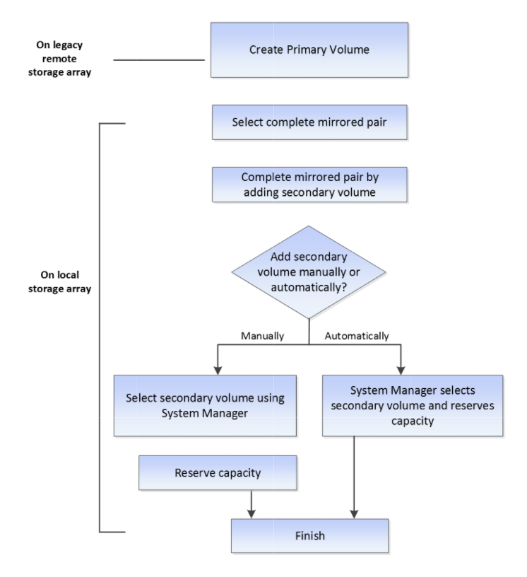

= Flujo de trabajo para reflejar un volumen de manera asíncrona
:allow-uri-read: 
:icons: font
:imagesdir: ../media/

[role="lead"]
En System Manager, es posible reflejar un volumen de forma asíncrona mediante los pasos siguientes.

image::../media/sam1130-flw-async-set-up-mirroring.gif[duplicación de configuración asíncrona de sam1130]

== Flujo de trabajo para completar una pareja reflejada de volúmenes primarios en un sistema heredado que no está gestionado por System Manager

Si se creó un volumen primario en un sistema heredado que no está gestionado por System Manager, es posible crear el volumen secundario con SANtricity System Manager.

