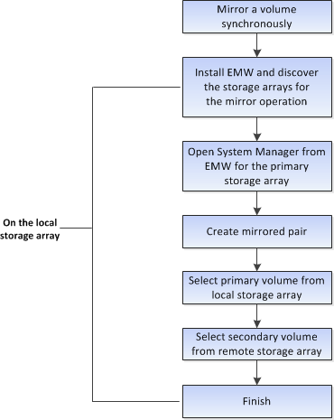

= Flujo de trabajo para reflejar un volumen de forma síncrona
:allow-uri-read: 
:icons: font
:imagesdir: ../media/

[role="lead"]
En SANtricity System Manager, es posible reflejar un volumen de manera síncrona mediante los pasos siguientes.

